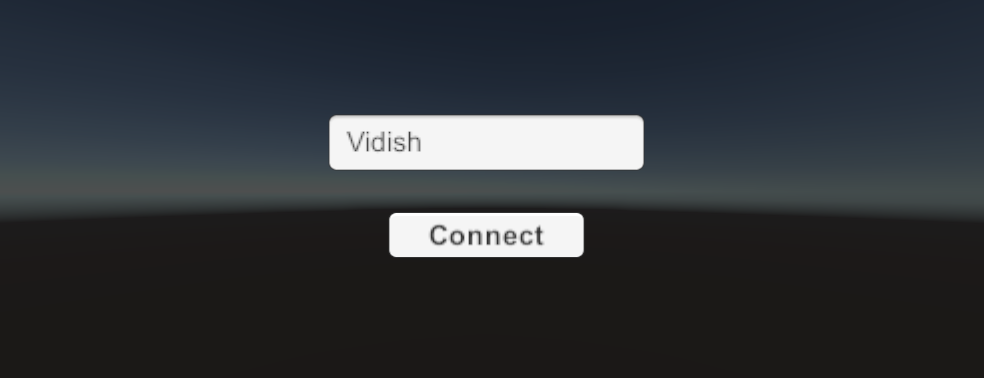
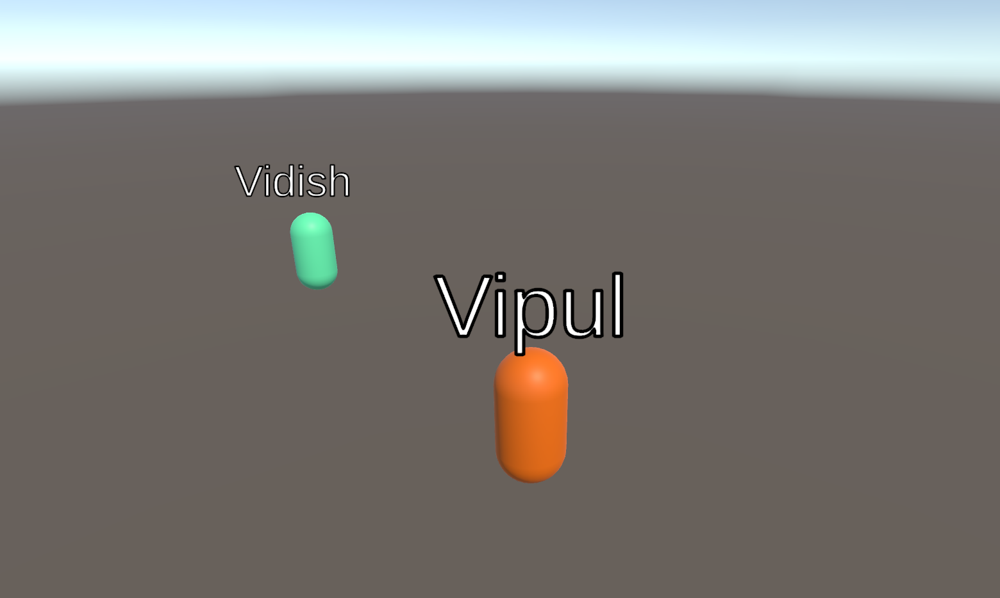
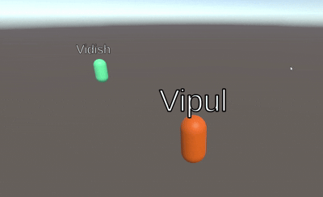

# Photon Multiplayer Demo (Unity)

A lightweight multiplayer demo project built using Unity and Photon PUN 2. Designed to showcase fundamental real-time multiplayer features like player movement, name syncing, color syncing, shooting, and basic UI.

## 🎮 Features

- **Real-time multiplayer** using Photon PUN 2
- **Player spawning** with unique names
- **Randomized player colors** synced across network
- **Bullet firing** with networked instantiation
- **Camera follow** for local player only
- **Clean UI** for name entry and connection
- **Late joiners** see synced players correctly

## 🛠 Tech Stack

- Unity `2022.3 LTS`
- Photon PUN 2 (Free tier)
- C# (MonoBehaviour + Photon callbacks)
- IPunObservable for syncing player state
- RPCs for event-based logic

## 📁 Project Structure

```
Assets/
├── Resources/
│   ├── Player.prefab
│   └── Bullet.prefab
├── Scenes/
│   └── Game.unity
├── Scripts/
│   ├── Player/
│   ├── Gameplay/
│   └── Networking/
├── Photon/
```

## 🧠 Learning Highlights

- Networking via `PhotonNetwork.Instantiate`
- State syncing with `IPunObservable` (color)
- Player identification using `photonView.IsMine`
- Clean late join handling via buffered events
- Local-only logic separation in multiplayer context

## 🔗 Author

Built by [Vidish S. Raut](https://www.linkedin.com/in/vidish-raut-9595b4b7/)  
Mumbai, India | Game Programmer | Unity & Unreal Developer

## 📸 Screenshots




## Demo Video



## 🧪 How to Run

1. Clone the repo or download as ZIP
2. Open in Unity `2022.3 LTS` or later
3. Add your Photon App ID to:
   ```
   Window > Photon Unity Networking > PhotonServerSettings
   ```
4. Hit **Play** or **Build** and run multiple instances to test multiplayer

---
##
Thank you for reviewing my project!
